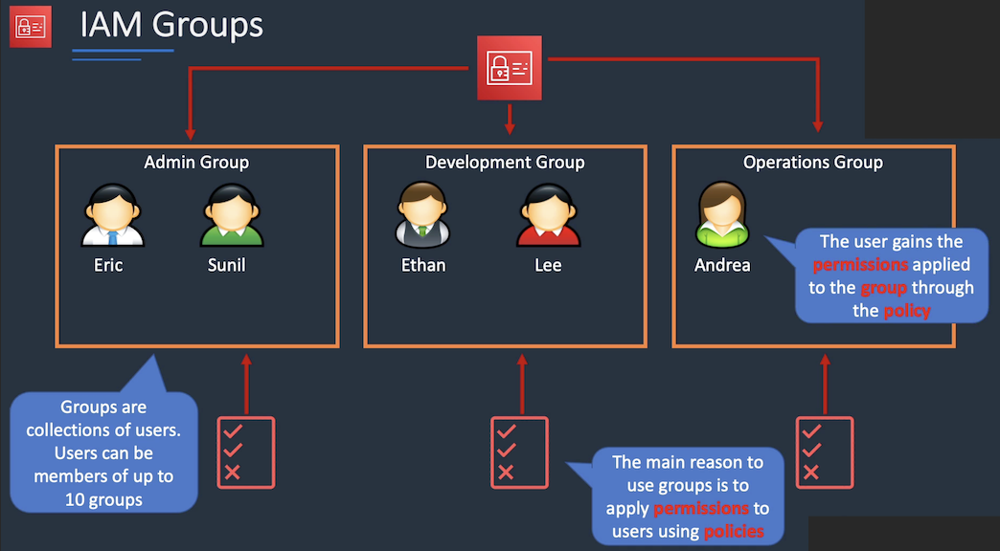

# aws
aws by terraform code


# Topics

* Terraform

- [ ] Structure date in terraform
- [ ] Set (for each ). List  Array 
- [ ] Dictionary List Set
- [ ] Map object
 
* AWS

- [ ] IAM
- [ ] Role & User
- [ ] Policy - types (managed/ customs / ?/?/ )
- [ ] Attributs 
- [ ] AWS ID
- [ ] Conditions


```

```